# Windows Server 2022 — Active Directory, File Services & Hybrid Identity Homelab

A two-part enterprise Windows homelab built from scratch in VirtualBox, simulating
a small-business IT environment. Covers Active Directory Domain Services, centralized
file services with least-privilege permissions, Group Policy automation, MSI software
deployment, and hybrid identity synchronization to Microsoft Entra ID.

Built to demonstrate the core day-to-day skills of a Help Desk / IT Support / Junior
Sysadmin role: user & permission management, GPO administration, file share
troubleshooting, and cloud identity sync.

---

**Author:** Diago Gonzalez · [github.com/Dovahk11n0](https://github.com/Dovahk11n0)

## Environment

| Component | Details |
|-----------|---------|
| Hypervisor | Oracle VirtualBox |
| Network | Internal Network `AD-Lab` (isolated) |
| DC01 | Windows Server 2022 — Domain Controller, DNS |
| FS01 | Windows Server 2022 — File Server, Entra Cloud Sync agent |
| CLIENT01 | Windows 10 Pro — domain-joined workstation |
| Domain | `lab.local` |
| Cloud | Microsoft Entra ID (Entra Cloud Sync) |

> All IPs, tenant names, and SIDs in this documentation are redacted / replaced with
> placeholders. This was a lab environment; no production data is present.

---

## Part A — Active Directory & File Services

### A1. Server & Network Configuration
FS01 configured with a static IP on the isolated `AD-Lab` internal network, DNS pointed
at the Domain Controller, then joined to the `lab.local` domain.

- Static IP: `10.0.0.20/24`, DNS → `10.0.0.10` (DC01)
- Domain join verified via `(Get-WmiObject Win32_ComputerSystem).Domain`
- Connectivity to DC confirmed (`Test-NetConnection`, 1ms RTT)

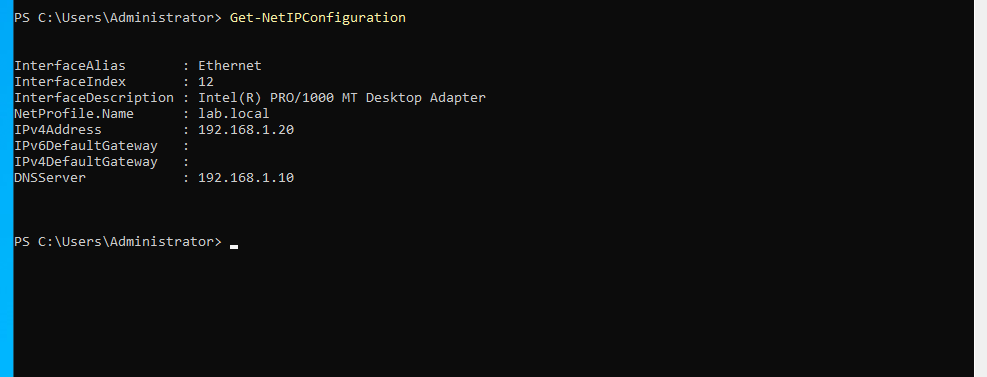
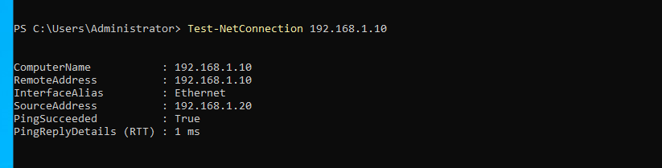
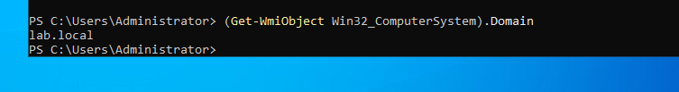

### A2. File Shares
Four shares created on FS01 to support departmental storage, home folders, folder
redirection, and software deployment. Home and Redirect use hidden shares (`$`).

| Share | Path | Purpose |
|-------|------|---------|
| `Shared` | `C:\Shares\Shared` | Company-wide shared storage |
| `Home$` | `C:\Shares\Home` | Per-user home drives (hidden) |
| `Redirect$` | `C:\Shares\Redirect` | Folder redirection target (hidden) |
| `Software` | `C:\Shares\Software` | MSI deployment source |
| `IT$` / `Finance$` | `C:\Shares\IT`, `\Finance` | Department-restricted shares |

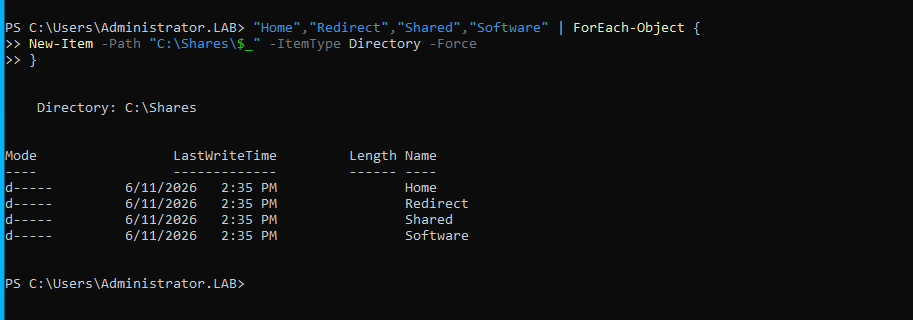
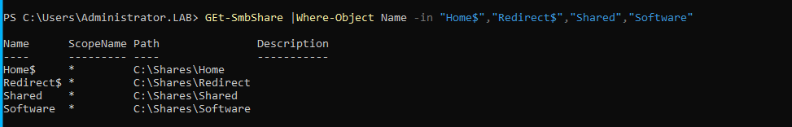

### A3. NTFS Permissions (Least Privilege)
Permissions set with `icacls` following least-privilege principles — each department
group has Modify only on its own share; Domain Users get shared space; Domain Computers
get Read on the software source.

| Resource | Principal | Access |
|----------|-----------|--------|
| `Shared` | Domain Users | Modify |
| `IT` | IT-Team | Modify |
| `Finance` | Finance-Team | Modify |
| `Software` | Domain Computers | Read/Execute |
| `Redirect` | inheritance removed; CREATOR OWNER + Domain Users (RX, this-folder-only) |

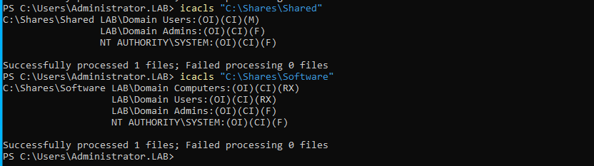
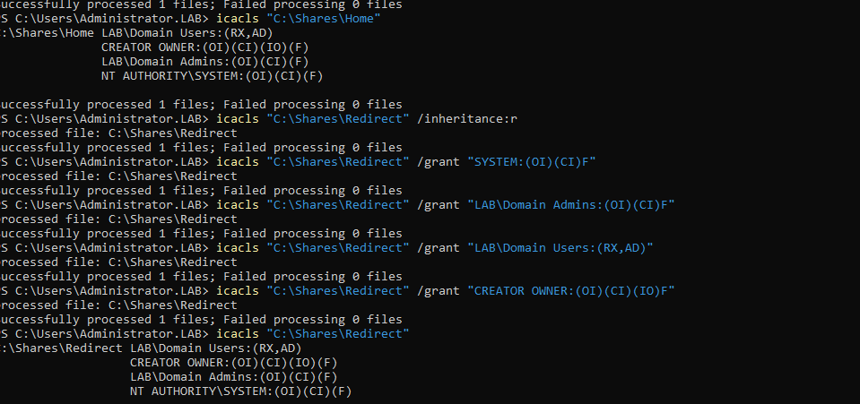
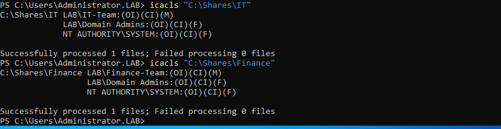

### A4. Group Policy — Drive Mapping & Folder Redirection
A GPO ("Drive Mappings - All Users") linked at the domain root maps drives per user and
per department, and redirects Desktop/Documents to the file server.

| Drive | Target | Scope |
|-------|--------|-------|
| `H:` | `\\FS01\Home$\%LogonUser%` | All users (home) |
| `G:` | `\\FS01\Shared` | All users |
| `S:` | `\\FS01\IT$` or `\\FS01\Finance$` | Item-level targeting by group |

Folder redirection sends Desktop & Documents to `\\FS01\Redirect$\%username%`.

Verified on CLIENT01 for two different users (different S: drive per department),
confirming item-level targeting works.

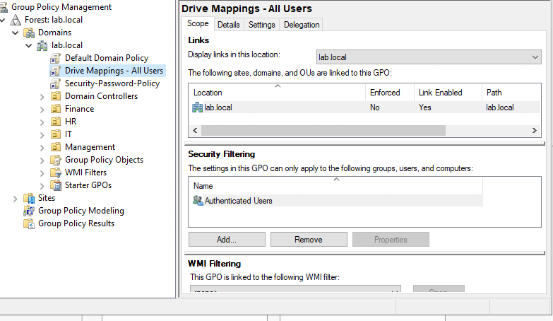
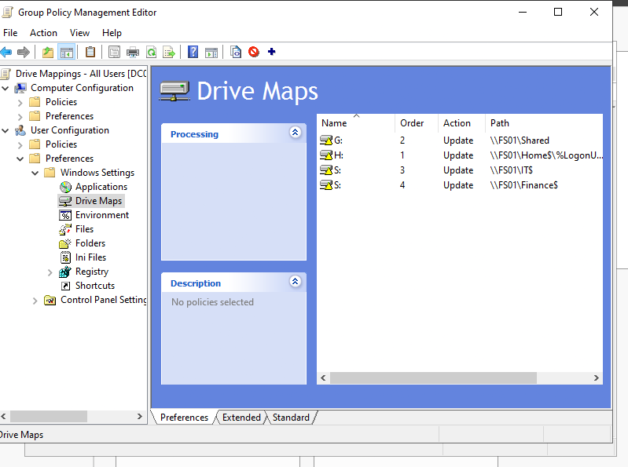
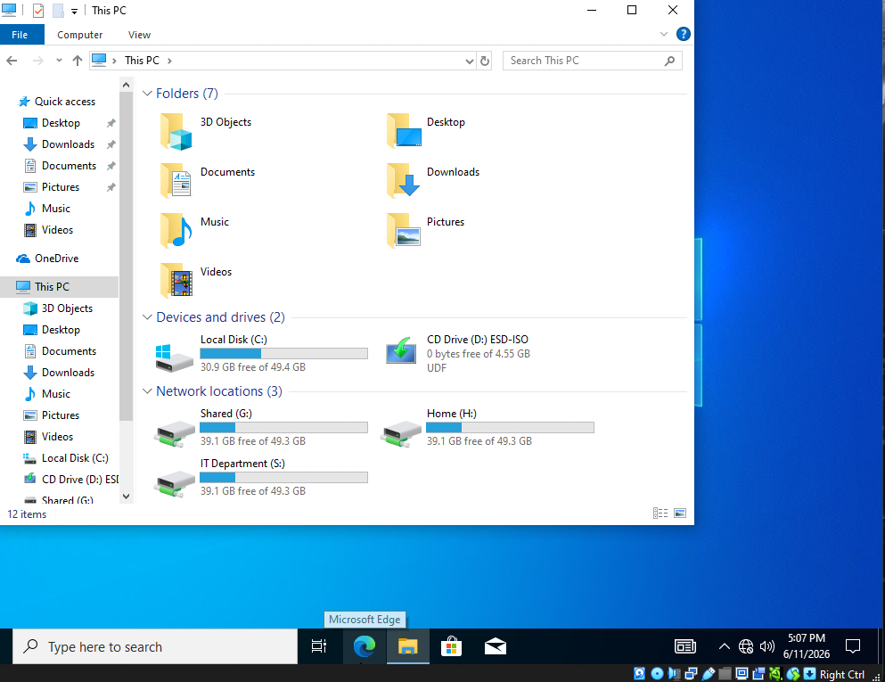
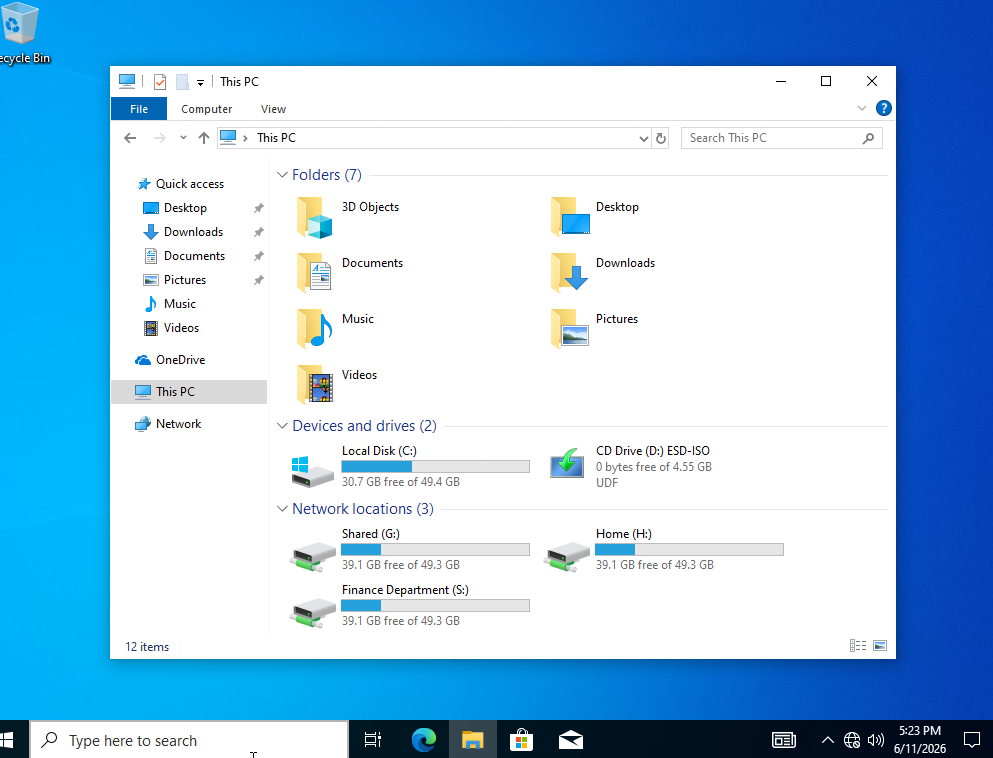
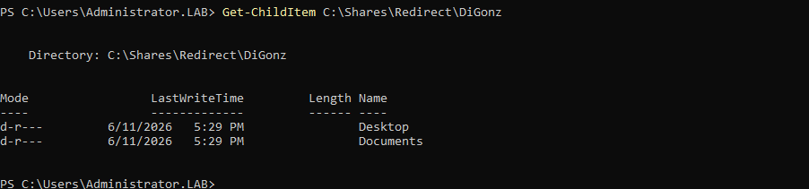

### A5. Software Deployment via GPO
7-Zip packaged as MSI on the `Software` share and deployed as a Computer-assigned
package. Verified installed on CLIENT01 after policy refresh + reboot.

- Source: `\\FS01\Software\7zip.msi` — 7-Zip 24.08 (x64), Assigned
- CLIENT01 moved to `OU=Workstations` to scope the policy

  
---

## Part B — Hybrid Identity (Microsoft Entra Cloud Sync)

Extends the on-prem environment to the cloud by syncing AD identities to Microsoft
Entra ID, enabling a single hybrid identity per user.

### B1. Preparation
- Added routable UPN suffix `@yourtenant.onmicrosoft.com` to the forest
- Bulk-updated all users' UPNs across the 4 department OUs via PowerShell `foreach`
- Created a Group Managed Service Account (gMSA) `provAgentgMSA` for the sync agent,
  authorized for DC01$ and FS01$

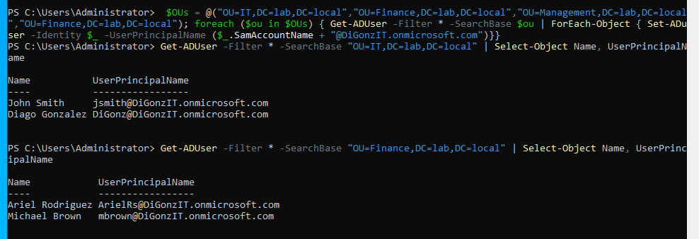
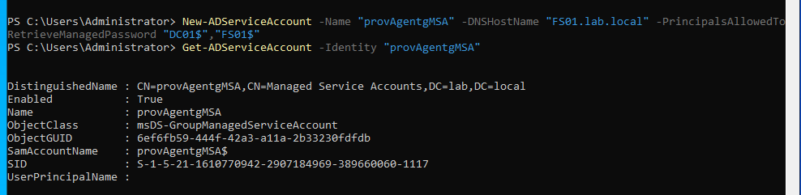

### B2. Agent Deployment
- Installed Entra Cloud Sync provisioning agent on FS01
- Configured against `lab.local` (gMSA) and the tenant (Global Admin)
- Agent confirmed **active** in the Entra portal
- Created a sync configuration with **scoping filters** limiting sync to the 4
  department OUs only (IT, HR, Finance, Management) — system/service accounts excluded
  by design (least privilege applied to cloud identity)

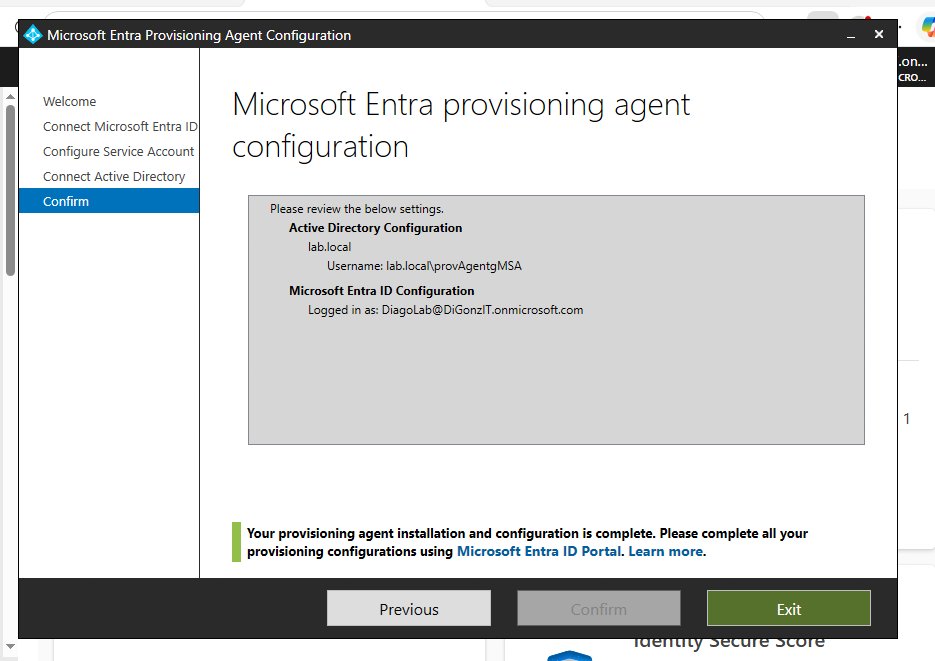
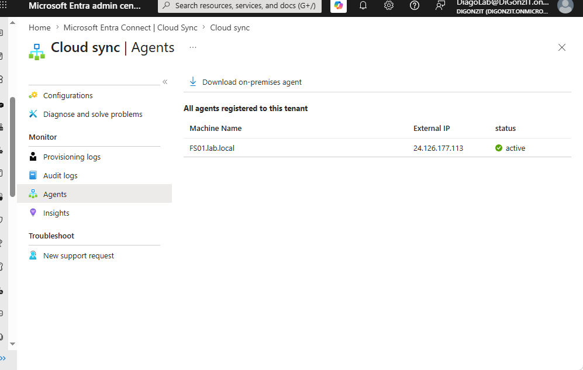
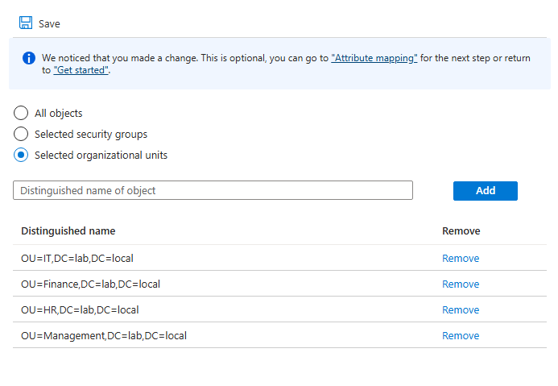
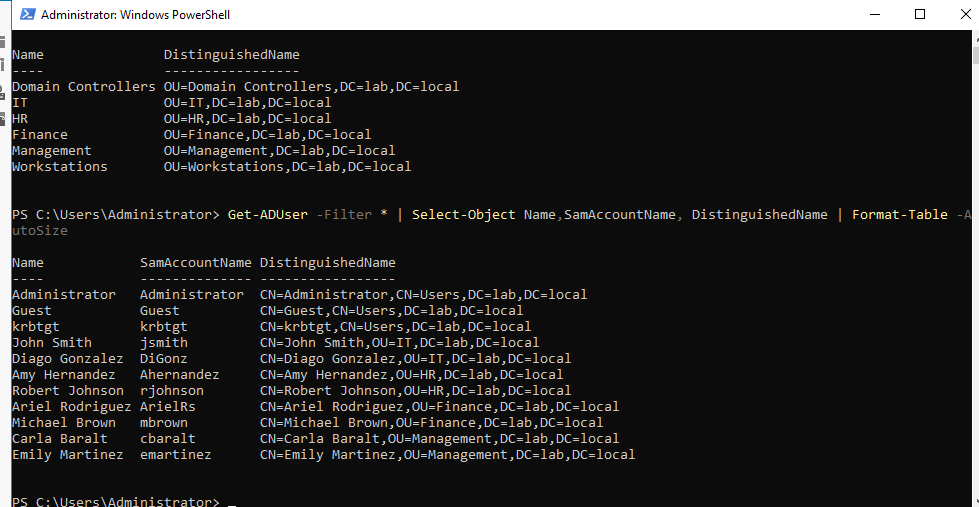

### B3. Status — Configured, sync blocked at provider gateway

The sync configuration is fully built and the agent is active, but provisioning cycles
fail with a **gateway-side timeout** before users populate in Entra. This was diagnosed
systematically (full write-up in [`docs/part-b-troubleshooting.md`](docs/part-b-troubleshooting.md)).

**Error:** `HybridIdentityServiceAgentTimeout` / `GatewayTimeout` (max_duration 600000ms),
originating at Microsoft's proxy layer (`x-ms-proxy-*` response headers), not the local agent.

**Causes ruled out with evidence:** LDAP/Global Catalog connectivity (389/3268 reachable),
host RAM (32 GB, no contention), VM clock skew (in sync), Password Hash Sync (disabled —
identical error persisted).

This is documented as a known limitation rather than left hidden. On-prem identity
management (Part A) is fully functional; the cloud sync remains a pending item at the
provider layer.

---

## Skills Demonstrated

- **Active Directory:** domain services, OU design, users/groups, gMSA
- **File Services:** SMB/NTFS, hidden shares, least-privilege `icacls`
- **Group Policy:** drive mapping, folder redirection, item-level targeting, MSI deployment
- **PowerShell:** bulk user administration, service accounts, verification scripting
- **Hybrid Identity:** Entra Cloud Sync, UPN routing, scoping filters
- **Troubleshooting:** systematic root-cause isolation, log analysis, evidence-based elimination

## Lessons Learned

- Copy exact values (DNs, service accounts) rather than typing from memory — real OU names
  differed from what I expected (`OU=IT`, not `OU=IT-Team`), which would have silently
  broken the scoping filter.
- Distinguish local issues from upstream/cloud-layer issues before iterating locally — the
  sync timeout lived at Microsoft's gateway, confirmed via proxy response headers.
- Documenting a failure path systematically (what was ruled out and how) is itself a
  demonstrable skill, and a legitimate portfolio state.
